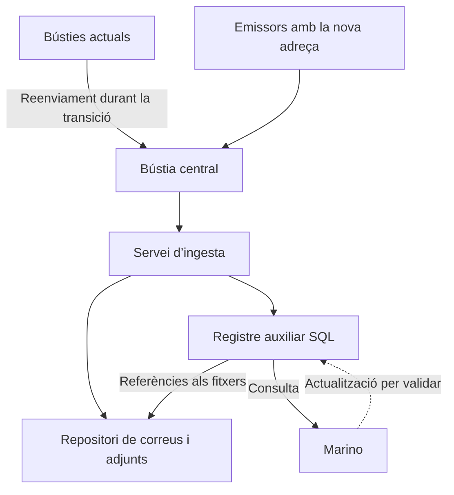

# Flower · Centralització i conciliació documental

Flower vol centralitzar les notes de càrrec, les factures de creditor i els avisos de pagament, relacionar-los amb la informació interna i gestionar-ne el seguiment a Marino. El projecte avança per fases: la recepció centralitzada ja aporta valor; arribar al control de documents vius i a la conciliació de la fase 4 és l’objectiu desitjable indicat pel client.

**Estat a 7 d’octubre de 2026:** definició funcional i arquitectura base; abast contractual, calendari i pressupost pendents. Aquesta especificació versionada és el context de desenvolupament per a Flower i l’equip de desenvolupament. Els acords, les propostes i les decisions obertes es mantenen separats.

## Context i material original

Flower és un client amb qui ja es treballa en altres àmbits. El nou repte és un procés administratiu de recepció, seguiment i conciliació documental que combina comunicacions de clients, documents externs i registres interns.

El correu del client presenta un disseny en set fases, exemples de Bauhaus i dos inventaris de remitents, destinataris, assumptes i noms d’adjunts. Especifica que la fase 1 ja representa un guany i que seria ideal assolir la fase 4.

**Font:** `Centralizacion Documentos.pdf` (font original opcional a `info/documents/Centralizacion-Documentos.pdf`, no versionada), cinc pàgines: esquema funcional i fases; avís de pagament Bauhaus; factura de creditor; notes de càrrec; inventaris. Els acords d’arquitectura provenen de la definició posterior del projecte, no del PDF.

## Documents i procés de negoci

| Document | Què representa | Sortida prevista al PDF |
| --- | --- | --- |
| Nota de càrrec | El client reclama un import per incidències de quantitat o preu, penalitzacions o devolucions. | Abonament a l’ERP. |
| Factura de creditor | El client factura Flower per ràpels o serveis, com promoció i logística, amb tractament d’IVA. | Factura de compra a l’ERP. |
| Avís de pagament | El client detalla quines factures paga i quines notes de càrrec o factures de creditor descompta. | Remesa de compensació a l’ERP. |

La regla conceptual del PDF és: **import indicat a l’avís = factures pròpies − notes de càrrec − factures de creditor**. Cal concretar signes, imports parcials, ajustos i toleràncies abans de convertir-la en una regla de conciliació.

L’avís és el punt on es creuen els documents. Una nota o factura pot arribar abans de l’avís i continuar pendent amb estat i responsable. Relacionar un document amb un avís, acceptar un càrrec i generar el registre a Marino són passos diferents. La confirmació del cobrament bancari no s’ha definit dins d’aquest abast.

## Acords de base i hipòtesi d’integració

| Tema | Definició actual | Estat |
| --- | --- | --- |
| Sistema operatiu final | La gestió acaba a Marino, que permet desenvolupament a mida consultant SQL. | Acordat |
| Entrada documental | Bústia corporativa central per als tres tipus de document. | Acordat |
| Transició | Regles de reenviament des de les bústies actuals i comunicació progressiva de la nova adreça als emissors. | Acordat |
| Ingesta | Procés automàtic sense interfície pròpia inicial, o headless. | Acordat |
| Conservació | Guardar el correu original i els adjunts, mantenint-ne el vincle. | Base de disseny recollida |
| Registre | SQL registra els documents des de l’inici, amb metadades, estat i referència al fitxer. | Base de disseny recollida |
| Fitxers | Correus i PDFs fora de SQL; SQL en guarda les rutes o referències. | Base de disseny recollida |
| Intercanvi amb Marino | Marino consulta el registre auxiliar i probablement en pot actualitzar les taules. | Lectura prevista; capacitat i mecanisme d’escriptura pendents de prova |
| Evolució | Primer centralització, traçabilitat i gestió; després lectura amb IA, validació i generació ERP. | Direcció de treball |

La substitució de Marino i una interfície paral·lela inicial queden fora del plantejament actual. La tecnologia d’ingesta, el repositori i el disseny físic de SQL encara no estan escollits.

## Arquitectura de referència

El servei d’ingesta rep la comunicació, conserva el correu i els adjunts i crea el registre corresponent. Marino utilitza el registre per consultar els documents i incorporar-ne la gestió operativa. El flux d’actualització des de Marino s’ha de validar amb una prova tècnica.

**Proposta pendent de concretar:** separar els camps que escriu la ingesta dels que gestiona Marino, incorporar reintents i detecció de duplicats, i registrar els esdeveniments de processament. Això ha de permetre recuperar errors sense perdre documents ni repetir operacions.

## Set fases del plantejament del client

| Fase | Funció descrita al PDF | Valor per a Flower |
| --- | --- | --- |
| 1 | Centralització en una bústia compartida. | Evitar la pèrdua de documents. |
| 2 | Repositori en carpetes per client. | Històric ordenat i fàcil de trobar. |
| 3 | Registre documental en una taula SQL. | Mesurar quantitat, client i import. |
| 4 | Documents vius amb estat i responsable; relació amb les línies dels avisos de pagament. | Control dels pendents i de la càrrega de cada persona. |
| 5 | Reconeixement de línies amb IA. | Reduir la transcripció manual. |
| 6 | Validació manual i compleció de la informació. | La IA proposa i una persona decideix. |
| 7 | Generació del document a l’ERP. | Completar el procés fins al registre operatiu. |

En la fase 5, la nota de càrrec requereix llegir motiu, referència a factura o albarà i import; la factura de creditor, concepte, període, base, IVA i total; l’avís, factures pagades i descomptes. En la fase 6 es revisen i accepten els càrrecs, es comproven les factures i es valida el quadrament de l’avís; una penalització pot entrar en disputa.

**Adaptació tècnica definida:** encara que el PDF situa SQL a la fase 3, el disseny registra documents des de la primera ingesta. La fase 3 amplia la consulta i explotació d’aquest registre.

## Primera fita proposada fins a la fase 4

La primera fita de treball és cobrir les fases 1 a 4 sense dependència d’IA: recepció centralitzada, arxiu, registre SQL i gestió de documents pendents des de Marino. Aquesta fita necessita concretar com s’introdueixen les dades que encara no es llegeixen automàticament.

**Resultat funcional proposat:** poder trobar cada document, consultar-ne el correu d’origen, identificar el client i el tipus, assignar un responsable, veure l’estat i relacionar-lo amb un avís de pagament. El contingut desconegut ha de quedar pendent de classificació o compleció.

La fase 4 implica control i relació documental; el grau de conciliació manual o assistida encara s’ha de definir. No equival a extracció automàtica ni a aprovació automàtica dels càrrecs. La generació dels abonaments, factures de compra i remeses correspon a la fase 7.

**Criteris d’acceptació proposats**

- [ ] Els correus i adjunts del conjunt de prova queden arxivats i vinculats al registre SQL.

- [ ] Un reenviament repetit o un reintent no crea un document operatiu duplicat.

- [ ] Marino permet consultar el registre i obrir el document associat amb els permisos previstos.

- [ ] Es poden gestionar estat, responsable i vincles documentals pel mecanisme acordat amb Marino.

- [ ] Els documents sense classificar, incomplets o amb errors continuen visibles i recuperables.

- [ ] Es pot reconstruir l’origen i l’historial d’un cas de conciliació.

Els criteris són una proposta per tancar l’abast, encara no una acceptació contractual.

## Funcionament diari proposat fins a la fase 4

**Proposta funcional pendent de validar amb Flower.** La primera entrega automatitza la recepció, la conservació i el registre; les persones completen la informació de negoci i confirmen les relacions documentals des de Marino. La lectura del contingut amb IA s’incorpora en una fase posterior.

### Recorregut d’un document

| Pas | Acció automàtica | Acció de la persona |
| --- | --- | --- |
| 1 Recepció | Detectar el correu a la bústia central, conservar-lo i registrar-ne l’origen i la data de recepció. | Revisar les incidències de recepció quan n’hi hagi. |
| 2 Arxiu i registre | Guardar els adjunts, vincular-los al correu i crear el registre documental provisional amb una referència estable al fitxer. | Resoldre els casos de fitxers il·legibles o sense document útil. |
| 3 Identificació | Aplicar regles configurades per proposar client i tipus quan els senyals siguin suficients. | Confirmar o corregir client i tipus; completar número extern, data, moneda i import. |
| 4 Assignació | Mostrar el document a la cua de treball; aplicar assignació per client si s’acorda una regla. | Assignar o canviar el responsable i registrar observacions. |
| 5 Seguiment | Mantenir visibles els documents pendents i la seva antiguitat. | Cercar referències a Marino i registrar els vincles coneguts; mantenir pendent el que encara no té avís. |
| 6 Arribada de l’avís | Registrar i arxivar l’avís amb el mateix circuit. | Introduir les línies necessàries per a la conciliació i vincular-les als documents externs i als registres interns. |
| 7 Quadrament | Calcular totals i diferències sobre les dades introduïdes, quan les regles de signes i imports estiguin definides. | Resoldre diferències, documents absents i coincidències ambigües. |
| 8 Tancament documental | Guardar els vincles, el resultat, la data i l’actor del canvi. | Confirmar el tancament documental o mantenir el cas pendent amb un motiu. |

Les funcions d’assignació per regla i càlcul de quadrament són propostes per a la fase 4. El mecanisme concret de consulta i edició a Marino depèn de la prova tècnica.

**Unitat de registre:** conservar tots els adjunts i començar amb un registre provisional per adjunt potencialment documental. Un correu pot contenir diversos documents; un PDF també pot contenir-ne més d’un. La identificació de documents dins d’un mateix PDF es resol manualment en aquesta primera entrega, amb diversos registres lògics vinculats al mateix fitxer si cal. No s’ha de confondre nombre d’adjunts amb nombre de documents de negoci.

### Informació inicial i compleció manual

| Moment | Informació disponible |
| --- | --- |
| Captura automàtica | Identificador intern, correu d’origen, remitents i destinataris disponibles, assumpte, data de recepció, nom d’adjunt, referència al fitxer i estat de processament. |
| Regles de reconeixement | Client i tipus proposats, regla aplicada i senyals utilitzats. Una regla sense coincidència suficient deixa el camp pendent. |
| Compleció humana | Client confirmat, tipus, número extern, data documental, moneda, import i responsable. |
| Conciliació manual | Referències i imports de les línies d’avís, documents relacionats, identificadors de Marino i motiu dels pendents o diferències. |

La ingesta no exigeix disposar de tots els camps de negoci per conservar el document. Els totals monetaris de consulta han de distingir documents amb import completat dels que encara no en tenen.

Per als avisos, es proposa introduir les referències i els imports de les línies necessàries per explicar el quadrament. Les dades de detall de motius, bases i IVA només s’incorporen en aquesta entrega si Flower les necessita per al seguiment; la captura exhaustiva de les fases 5 i 6 es definirà separadament.

### Estats proposats i criteris de canvi

Es proposa mantenir dimensions separades per evitar que un únic estat barregi un error tècnic amb una decisió de negoci.

| Dimensió | Estats proposats | Criteri |
| --- | --- | --- |
| Processament tècnic | Pendent, complet, error. | Complet quan el correu i els adjunts previstos estan conservats i el registre és accessible; error amb causa i possibilitat de reintent. |
| Compleció documental | Pendent d’identificar, pendent de dades, complet. | Complet quan s’han informat els camps mínims acordats per al tipus documental. |
| Relació amb avisos per a notes i factures | Sense avís, vinculació parcial, vinculat. | Reflecteix la cobertura del document pels avisos, sense implicar acceptació del càrrec. |
| Conciliació de l’avís | Pendent, en revisió, amb incidències, conciliat documentalment. | Tancament després de confirmar els vincles i explicar el quadrament segons les regles acordades. |

“Conciliat documentalment” significa que s’han explicat les línies i els imports de l’avís. No acredita cobrament bancari, aprovació d’un càrrec ni generació comptable. El responsable pot registrar una observació de disputa; el circuit formal d’aprovació de la fase 6 continua pendent de definició.

Un document vinculat parcialment conserva visible el saldo pendent quan el model de distribució d’imports estigui definit. Si es modifica una dada que afecta un avís ja conciliat, es proposa reobrir-ne la revisió conservant l’historial.

### Cas complet de treball amb Bauhaus

Aquest recorregut il·lustra la proposta amb les referències del PDF; l’ordre d’arribada és hipotètic.

1. Arriba una nota de càrrec amb número **108100009472**. El servei conserva correu i PDF i crea el registre provisional.

2. La persona confirma Bauhaus i el tipus documental, completa les dades i associa la referència interna **R2700.123** indicada al material del client. El document queda sense avís i amb responsable.

3. Arriba l’avís **19006484**, de **31 d’agost de 2026**. Es conserva i registra pel mateix circuit.

4. La persona introdueix les línies i relaciona **MR108100009472** amb la nota ja registrada. Conserva les dues referències originals i confirma que corresponen al mateix cas.

5. També revisa els vincles **2000353168 → R2700.172** i **604152 → A2700.145**, així com la resta de línies de l’avís. Els tres exemples assenyalats no són suficients per donar per conciliat l’avís complet.

6. Es comprova el quadrament amb les dades disponibles. Si falta un document o una línia no quadra, el cas continua amb incidències i un responsable.

7. Quan totes les línies s’han explicat i el quadrament és correcte segons les regles acordades, la persona confirma el tancament documental.

La incorporació de l’avís abans de la nota també ha de ser possible: es conserva la línia pendent de vincular i es completa la relació quan arriba el document.

### Incidències i recuperació proposades

| Cas | Comportament proposat |
| --- | --- |
| Mateix correu processat de nou | Reutilitzar la captura existent i completar el que falti, sense repetir registres. |
| Mateix adjunt en un altre reenviament | Detectar coincidència de fitxer i conservar la nova evidència de recepció vinculada al document existent; no fusionar automàticament casos dubtosos. |
| Mateix número amb PDF diferent | Tractar-lo com a possible revisió o conflicte i demanar revisió humana; conservar ambdós originals. |
| Client o tipus desconeguts | Mantenir el registre pendent d’identificació en una cua visible. |
| Avís amb document absent | Conservar la línia i la referència pendent, amb responsable de seguiment. |
| Import parcial o diferència | Mantenir pendent o en incidència fins a aplicar una regla acordada; evitar un tancament automàtic per coincidència de número. |
| Error en arxiu o SQL | Registrar la incidència en un mecanisme operatiu independent quan SQL no estigui disponible, i reintentar sense marcar la captura com a completa. |
| Correcció d’un vincle | Registrar qui el corregeix, quan i per què; revisar els avisos afectats. |

### Funcions mínimes a Marino

La proposta requereix una consulta de documents amb filtres per client, tipus, estat, responsable i antiguitat; accés al correu i als fitxers; edició dels camps manuals; i una vista de l’avís amb les seves línies, vincles i diferències. Les pantalles es concreten amb el responsable tècnic de Marino.

Es proposa repartir l’operació entre la persona que identifica i completa documents, la que gestiona la conciliació i la que resol errors tècnics. Una mateixa persona pot assumir més d’una funció; Flower ha d’assignar els responsables efectius.

### Validació necessària per tancar aquesta proposta

- [ ] Confirmar els camps obligatoris per a cada tipus de document.

- [ ] Confirmar qui completa les dades i gestiona els pendents.

- [ ] Acordar com s’introdueixen les línies dels avisos a Marino.

- [ ] Definir signes, toleràncies i tractament d’imports parcials.

- [ ] Acordar qui pot tancar i reobrir la conciliació documental.

- [ ] Demostrar lectura, edició i accés a fitxers des de Marino.

**Resultat de la primera entrega proposada:** Flower disposa d’un registre documental consultable, amb originals conservats, responsables i pendents visibles, i pot relacionar manualment els avisos amb els documents i registres de Marino. L’esforç de lectura i introducció del contingut continua sent manual fins a incorporar la fase 5.

## Model de dades inicial proposat

| Entitat | Contingut previst |
| --- | --- |
| emails | Identificador del missatge, remitents, destinataris, assumpte, dates, origen i referència al correu arxivat. |
| documents | Vincle al correu, client, tipus, número extern, data, moneda, import quan es conegui, referència al fitxer, estat i responsable. |
| document_lines | Línies dels avisos i dels altres documents, imports i referències externes. |
| document_relations | Relacions entre documents, línies d’avís i registres de Marino. |
| processing_events | Processament, errors, reintents i canvis d’estat amb data i actor. |
| erp_operations | Operacions de generació a Marino, resultat i identificador ERP, per a l’evolució de la fase 7. |

És un model lògic per discutir, no un esquema SQL aprovat. Les entitats de línies i relacions donen suport a la fase 4; les d’extracció i generació poden ampliar-se en fases posteriors.

**Proposta de disseny:** separar estat tècnic, estat de validació de negoci i estat de conciliació. Un document rebut correctament pot estar pendent d’acceptació; un document vinculat a un avís pot continuar en disputa. Els camps desconeguts a la ingesta s’han de completar després, mantenint l’original i la traçabilitat.

## Conciliació i exemples Bauhaus

El PDF mostra l’avís Bauhaus **19006484**, de **31 d’agost de 2026**, amb referències externes que s’han de vincular a identificadors interns de Marino.

| Referència de l’avís | Identificador anotat de Marino | Observació |
| --- | --- | --- |
| MR108100009472 | R2700.123 | La nota de càrrec mostra 108100009472, sense el prefix MR. |
| 2000353168 | R2700.172 | La referència també apareix en un exemple de nota de càrrec. |
| 604152 | A2700.145 | El document de creditor mostra 000604152, amb zeros inicials. |

Aquests exemples fan necessari conservar la referència original i definir regles de normalització abans de cercar coincidències. També mostren que el títol del PDF pot ser ambigu: l’exemple classificat com a factura de creditor porta el literal “Nota de cargo”.

**Proposta de lògica de conciliació:** identificar client i moneda, conservar i normalitzar referències, cercar coincidències en Marino, comprovar imports i dates, proposar el vincle i deixar els casos ambigus per a revisió. Els prefixos, els zeros inicials i les toleràncies s’han de tractar amb regles explícites per client.

Continuen oberts els casos de pagament parcial, múltiples avisos per document, càrrecs sense document rebut, rectificacions, duplicats i diferències d’import. Tampoc s’ha establert si els identificadors R i A permeten inferir el tipus de document de manera general.

## Inventari de canals i classificació

L’inventari d’avisos de pagament inclou ECI, Condis i Bauhaus. L’inventari de notes i factures inclou Consum, Neopro, Eroski, Bauhaus, Unifersa, Verdecora i Corma, amb informació encara incompleta en alguns casos.

Els avisos arriben actualment a bústies com gcc i facturacio. L’inventari mostra un mateix remitent de reports.edicomnet.com per ECI i Condis; per a Bauhaus hi ha remitents de bauhaus.es i bahag.com. Alguns noms d’adjunt contenen número documental i data; d’altres són genèrics, com FLOWER.pdf.

**Proposta:** utilitzar l’inventari com a configuració de regles per client, combinant remitent, destinatari, assumpte i nom d’adjunt. El remitent sol no sempre identifica el client, i el nom d’un fitxer no garanteix el seu tipus de negoci. Els casos no resolts han de quedar pendents de revisió.

Bauhaus és el cas d’exemple complet disponible i un candidat a pilot; la selecció definitiva dels clients del pilot encara està oberta.

## Decisions obertes

| Decisió | Què cal resoldre | Efecte |
| --- | --- | --- |
| Bústia i accés | Adreça central, plataforma de correu, permisos i accés del servei. | Habilita la ingesta. |
| Servei d’ingesta | Tecnologia, execució, freqüència, supervisió i recuperació d’errors. | Determina l’operació del servei. |
| Repositori | Ubicació, carpetes o organització equivalent, permisos, retenció i accés des de Marino. | Assegura conservació i consulta. |
| SQL | Motor, esquema auxiliar, allotjament, permisos i responsables dels camps. | Tanca el contracte de dades. |
| Integració Marino | Lectura i escriptura de taules auxiliars, accés als fitxers i personalització de pantalles. | Confirma la viabilitat de la fase 4. |
| Dades inicials | Qui introdueix client, tipus, data, número i import abans de la IA. | Evita registres incomplets sense circuit de resolució. |
| Conciliació | Referències, signes, toleràncies, imports parcials i autoritat per tancar un cas. | Defineix el comportament funcional. |
| Duplicats i correccions | Identificació, revisions, substitucions i historial. | Evita duplicacions i pèrdua de traçabilitat. |
| Volum i històric | Documents mensuals, adjunts, clients, formats i càrrega retrospectiva. | Permet dimensionar i pressupostar. |
| Pilot i operació | Clients, usuaris, responsable funcional i suport. | Defineix prova i desplegament. |
| Fases posteriors | Proveïdor i qualitat de lectura IA, validació i generació ERP. | Permet valorar les fases 5 a 7. |

No hi ha calendari, cost ni proveïdor tecnològic tancats.

## Pla de treball proposat

1. **Validar el procés amb Flower.** Recórrer un cas real de cada tipus documental, des del correu fins al registre a Marino, i concretar responsables i estats.

2. **Provar la integració amb Marino.** Consultar un registre auxiliar, obrir el fitxer vinculat i demostrar com s’actualitzaran estat i responsable.

3. **Tancar la primera entrega.** Definir bústia, repositori, contracte SQL, dades manuals, regles de duplicats i criteris d’acceptació de les fases 1 a 4.

4. **Construir i provar un pilot.** Utilitzar un conjunt representatiu de correus, adjunts, referències i incidències; Bauhaus és un candidat.

5. **Valorar l’evolució.** Mesurar l’esforç manual restant i prioritzar lectura amb IA, validació i generació a l’ERP.

La següent decisió que desbloqueja el projecte és confirmar la lectura i l’actualització del registre auxiliar des de Marino. Amb aquesta prova i el volum documental es podrà concretar una proposta d’execució.

## Context per al desenvolupament amb Claude

**Destinació definida per Manel:** el context necessari per desenvolupar es versiona a `docs/` del repositori privat. La carpeta local `info/` queda reservada exclusivament per a documents reals, com factures, notes de càrrec, avisos i correus originals, i està exclosa de Git.

Repositori privat: [zenital/zenital-centralitzacio-documental](https://github.com/zenital/zenital-centralitzacio-documental). Un clon proporciona les instruccions i el context per començar el disseny tècnic amb Claude, sense necessitat de copiar `info/`.

| Fitxer | Funció | Git |
| --- | --- | --- |
| README.md | Preparació, ordre de lectura i inici del treball. | Versionat |
| CLAUDE.md | Instruccions per a Claude i lectura del context compartit. | Versionat |
| .gitignore | Exclusió de documents reals i configuració local. | Versionat |
| docs/00-index.md | Índex i resum del context compartit. | Versionat |
| docs/01-context-projecte.md | Definició funcional consolidada, acords i propostes. | Versionat |
| docs/02-decisions-i-pendents.md | Dependències i decisions obertes. | Versionat |
| docs/03-inici-desenvolupament.md | Primera tasca i verificació de la sessió de desenvolupament. | Versionat |
| info/documents/ | Documents reals i correus originals locals. | Ignorat |

La carpeta `info/` és opcional per començar el disseny i treballar amb dades sintètiques; només cal distribuir els documents reals necessaris per a una prova concreta. No conté especificacions, decisions, backlog ni instruccions. `docs/` és la referència versionada per al desenvolupament; aquesta Page serveix per revisar el projecte. Els canvis acordats s’han de reflectir en tots dos suports, sense sincronització automàtica.

La següent tasca de Claude és proposar components, contractes de dades, tractament d’errors i backlog de la primera entrega. La tecnologia i els adaptadors reals es concreten amb les dependències del projecte, especialment Marino.

## Registre de continuïtat

**7 d’octubre de 2026:** consolidació del procés del client, les set fases, la base d’arquitectura i la hipòtesi d’integració amb Marino. Incorporació del model lògic proposat, exemples de conciliació, criteris d’acceptació i decisions pendents.

**7 d’octubre de 2026, ampliació funcional:** incorporació del recorregut diari proposat fins a la fase 4, repartiment entre automatització i treball manual, estats, cas Bauhaus, incidències i funcions mínimes a Marino. Aquesta ampliació és una proposta pendent de validació amb Flower; no modifica els acords de base.

**8 d’octubre de 2026:** canvi acordat en l’organització del repositori. Tot el context de desenvolupament es versiona a `docs/`; `info/` queda exclusivament per a documents reals locals. La clonació proporciona el context per iniciar el disseny, amb les dependències externes encara pendents.

En cada actualització s’han de mantenir diferenciats el material original de Flower, els acords confirmats i les propostes. Una proposta només passa a acord quan hi ha confirmació. Cal registrar els canvis d’abast o de decisió amb data i actualitzar aquest suport com a referència del projecte.
